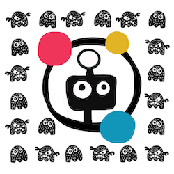
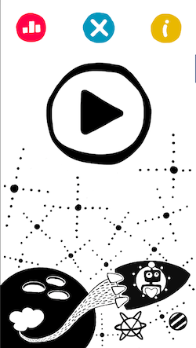
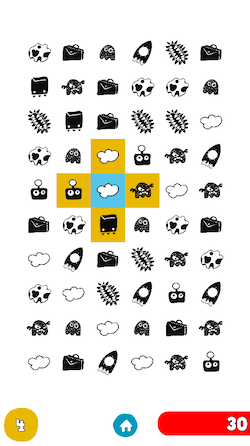
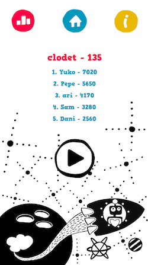

# El Viaje

El Viaje es un juego de rompecabezas para toda la familia, completamente gratuito y sin anuncios, que consiste en intercambiar imágenes para alinear tres o más del mismo tipo (horizontal o verticalmente).

Es un desafío visual con movimientos limitados donde la dificultad radica en el número y la similitud de las imágenes presentes en el tablero de juego. Además, cuenta con una tabla de clasificación en línea para medir tu habilidad contra otros jugadores.

Las ilustraciones del juego están basadas en una historia para entrenar la percepción visual en bebés, titulada "El Viaje".

